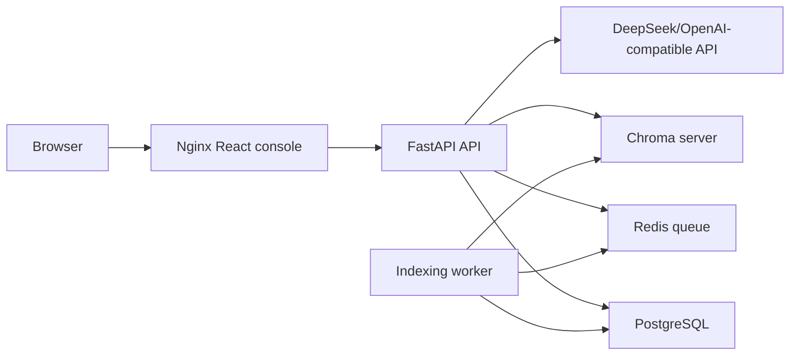

# Production Deployment

This profile turns the demo into a small enterprise-pilot deployment: FastAPI,
React/Nginx, PostgreSQL, Redis, Chroma, and a background indexing worker.

## Architecture



## Quick Start

1. Copy the environment template:

```bash
cp .env.example .env
```

2. Edit `.env` and set at least:

```env
DEEPSEEK_API_KEY=your_key
API_AUTH_TOKEN=replace_with_a_random_token
VITE_API_AUTH_TOKEN=replace_with_the_same_token
```

For an offline local bge-m3 embedding model, keep the Compose defaults or set:

```env
TRANSFORMERS_OFFLINE=1
HF_HUB_OFFLINE=1
LEGAL_RAG_EMBEDDING_MODEL=/models/hf-hub/models--BAAI--bge-m3/snapshots/5617a9f61b028005a4858fdac845db406aefb181
LEGAL_RAG_RERANKER_MODEL=off
LOCAL_HF_HUB=/Users/your-name/.cache/huggingface/hub
LOCAL_BGE_M3_MODEL_DIR=/Users/your-name/.cache/huggingface/hub/models--BAAI--bge-m3
```

If `models--BAAI--bge-m3` is a symlink, set `LOCAL_BGE_M3_MODEL_DIR` to the
real directory so Docker can mount the snapshot and blob files correctly.

3. Start the production-like stack:

```bash
docker compose -f docker-compose.prod.yml up --build
```

4. Open the console:

- Frontend: `http://localhost:8080`
- API health: `http://localhost:8080/api/health`
- Readiness: `http://localhost:8080/api/ready`
- Metrics: `http://localhost:8080/api/metrics`

## Runtime Notes

- Core public APIs stay stable: `/api/chat`, `/api/review/contract`,
  `/api/documents/upload`, `/api/documents`, `/api/reviews/*`.
- Upload, document list, and review approval endpoints are protected when
  `API_AUTH_TOKEN` is configured. Clients can send `X-API-Key` or
  `Authorization: Bearer <token>`.
- In local development without `DATABASE_URL` and `REDIS_URL`, the app keeps
  using JSON registries and inline document indexing.
- In the Compose profile, document upload creates a `pending` record, pushes an
  indexing task to Redis, and the worker updates status to `ready` or `failed`.

## Operations

- PostgreSQL volume: `postgres_data`
- Redis volume: `redis_data`
- Chroma volume: `chroma_data`
- Uploaded files volume: `uploads`

Back up PostgreSQL and Chroma together so document metadata and vector data stay
consistent:

```bash
docker compose -f docker-compose.prod.yml exec postgres \
  pg_dump -U legal_rag legal_rag > backup.sql
```

Useful checks:

```bash
curl http://localhost:8080/api/ready
curl http://localhost:8080/api/metrics
docker compose -f docker-compose.prod.yml logs -f api worker
API_AUTH_TOKEN=replace_with_a_random_token scripts/production_smoke.sh
```

## Acceptance Flow

1. Start the stack and confirm `/api/ready` is `ok` or only model API is
   `degraded` when no key is configured.
2. Upload a `.txt`, `.md`, `.pdf`, or `.docx` policy document.
3. Refresh documents until status becomes `ready`.
4. Ask a policy question in the console.
5. Submit a high-risk contract and approve/reject the pending review.
6. Check `/api/metrics` and API/worker logs for request IDs, latency, and task
   outcomes.
