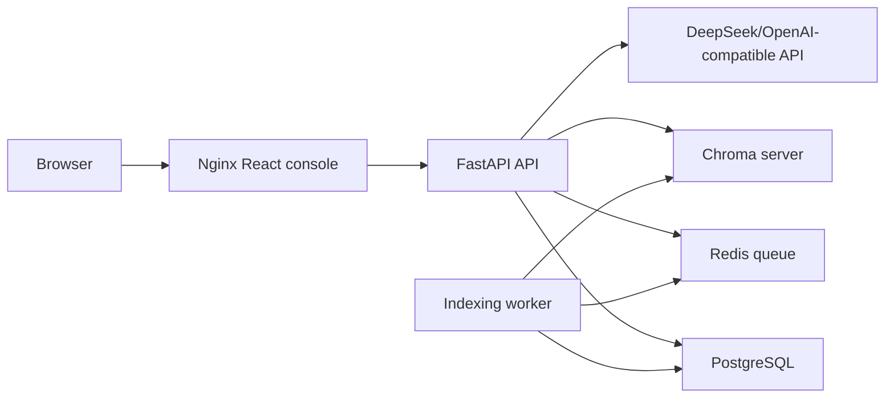

# Production Deployment

This profile turns the demo into a small enterprise-pilot deployment: FastAPI,
React/Nginx, PostgreSQL, Redis, Chroma, and a background indexing worker.

## Architecture



## Quick Start

1. Copy the environment template:

```bash
cp .env.production.example .env
```

2. Edit `.env` and set at least:

```env
DEEPSEEK_API_KEY=your_key
API_AUTH_TOKEN=replace_with_a_random_token
```

Online defaults download `BAAI/bge-small-zh-v1.5` to the shared model cache.
No host model/cache directory is mounted. To use a fully prepared offline model,
append `.env.offline.example` overrides and set:

```env
TRANSFORMERS_OFFLINE=1
HF_HUB_OFFLINE=1
LEGAL_RAG_EMBEDDING_MODEL=/models/embedding
LEGAL_RAG_RERANKER_MODEL=off
LOCAL_EMBEDDING_MODEL_DIR=./.cache/embedding-model
```

The model directory must contain complete files; symlinks must not escape the
mount. Start offline with both `-f docker-compose.prod.yml` and
`-f docker-compose.offline.yml`. Missing bind source directories fail explicitly.

3. Start the production-like stack:

```bash
docker compose -f docker-compose.prod.yml up --build
```

The one-shot `migrate` service applies Alembic migrations before API/worker start.
Configuration and reliability boundaries: [configuration guide](docs/configuration-and-boundaries.md).

4. Open the console:

- Frontend: `http://localhost:8080`
- API health: `http://localhost:8080/api/health`
- Readiness: `http://localhost:8080/api/ready`
- Metrics: `http://localhost:8080/api/metrics`

## Runtime Notes

- Core public APIs stay stable: `/api/chat`, `/api/review/contract`,
  `/api/documents/upload`, `/api/documents`, `/api/reviews/*`.
- Upload, document list, and review approval endpoints are protected when
  `API_AUTH_TOKEN` is configured. Clients can send `X-API-Key` or
  `Authorization: Bearer <token>`. The browser console logs in with that token
  and then uses an HttpOnly session cookie.
- In local development without `DATABASE_URL` and `REDIS_URL`, the app keeps
  using JSON registries and inline document indexing.
- In the Compose profile, document upload creates a `pending` record, pushes an
  indexing task to Redis, and the worker updates status to `ready` or `failed`.

## Operations

- PostgreSQL volume: `postgres_data`
- Redis volume: `redis_data`
- Chroma volume: `chroma_data`
- Uploaded files volume: `uploads`

Back up PostgreSQL and Chroma together so document metadata and vector data stay
consistent:

```bash
docker compose -f docker-compose.prod.yml exec postgres \
  pg_dump -U legal_rag legal_rag > backup.sql
```

Useful checks:

```bash
curl http://localhost:8080/api/ready
curl http://localhost:8080/api/metrics
docker compose -f docker-compose.prod.yml logs -f api worker
API_AUTH_TOKEN=replace_with_a_random_token scripts/production_smoke.sh
API_AUTH_TOKEN=replace_with_a_random_token scripts/production_smoke.sh --no-llm
API_AUTH_TOKEN=replace_with_a_random_token ./venv/bin/python scripts/stress_mixed.py
```

## Acceptance Flow

1. Start the stack and confirm `/api/ready` is `ok` or only model API is
   `degraded` when no key is configured.
2. Upload a `.txt`, `.md`, `.pdf`, or `.docx` policy document.
3. Refresh documents until status becomes `ready`.
4. Ask a policy question in the console.
5. Submit a high-risk contract and approve/reject the pending review.
6. Check `/api/metrics` and API/worker logs for request IDs, latency, and task
   outcomes.

## 2026-10-06 本轮复验

全新测试 project 从空 volumes 构建并启动，migrate 到 `20260528_0001`；真实 bge-small embedding、worker、PostgreSQL、Redis、Chroma 1.5.9 制度检索、审批、鉴权、指标均通过。API/worker 重启后文档仍 ready，重复批准返回 409。无模型 Key，model_api 如实 degraded；不证明法律回答质量。

另用完整 bge-small 模型文件目录及 offline override 复验上传/索引/查询。仅验证本地文件加载及 offline 设置，未模拟断网。原配置将只读模型父目录与子目录嵌套挂载导致空宿主机目录冷启动失败；已将离线挂载移至单独 override。LlamaIndex 缓存目录通过 `LLAMA_INDEX_CACHE_DIR` 与共享缓存 volume 对齐。

记录：`docs/validation/production-smoke-20261006.json`、`offline-smoke-20261006.json`；Python 3.12 / Linux aarch64 依赖快照 `runtime-packages-20261006.txt`。最终默认配置复验见 `default-final-smoke-20261006.json`（复用上述 volumes）。报告来自记录的基线提交加当时工作区变更，配置摘要可核对；不是该基线提交原样通过的声明。

轻量远端CI：提交 `bd8b76b`，[run 37420768381](https://github.com/xxCasual/Enterprise_Legal_RAG_Agent/actions/runs/37420768381) Python/路由与前端检查均成功；生产/离线真实模型索引由本地报告覆盖，尚未在CI内构建完整模型栈。
