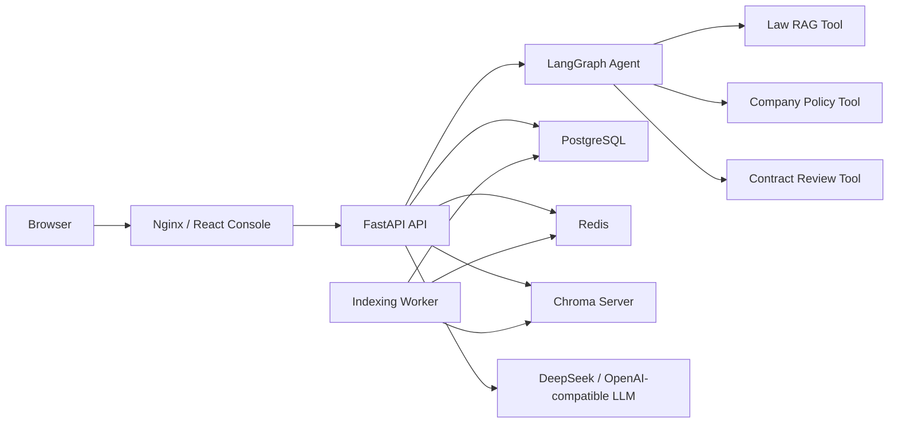

# Enterprise Legal RAG Agent

面向中国企业劳动合规场景的 RAG + Agent 项目。它不是完整 SaaS，而是一个“企业试点级生产化”样例：保留简历项目的可演示性，同时补齐容器化部署、数据库持久化、异步文档索引、服务状态检查、基础指标、简单管理鉴权和失败恢复能力。

当前项目继续使用 Python/FastAPI 做业务后端，没有引入 Java。并发目标按小规模企业内部试点设计：几十个内部用户、少量同时上传、问答延迟主要受 LLM 和 embedding 检索链路影响。

## 核心能力

| 能力 | 说明 |
|---|---|
| 统一问答 | `POST /api/chat` 自动路由到法律问答、企业制度问答、合同审查或范围外拒答 |
| Tool-calling Agent | LangGraph 编排 guardrail、LLM planner、fallback 分类器、工具执行和答案汇总 |
| 法律 RAG | LlamaIndex + Chroma + BM25 + bge embedding，检索劳动法、劳动合同法等内置法律文本 |
| 企业制度 RAG | 上传 `.txt`、`.md`、`.pdf`、`.docx` 后写入独立企业制度知识库 |
| 异步索引 | 生产模式下上传只创建任务，worker 从 Redis 消费并完成解析、切分、embedding、写入 Chroma |
| 合同审查 | 规则驱动识别试用期、工资、工时、社保、解除、竞业限制等劳动合同风险 |
| 人工复核 | 高风险合同进入审批队列，人工通过后才返回完整审查结果 |
| 生产依赖 | Docker Compose 编排 FastAPI、worker、PostgreSQL、Redis、Chroma、Nginx 前端 |
| 可观测性 | 结构化请求日志、`X-Request-ID`、接口耗时、工具调用耗时、`/api/ready`、`/api/metrics` |
| 前端控制台 | React + Vite + TypeScript，覆盖问答、文档、合同审查、人工审批和系统状态 |

## 技术栈

| 层次 | 技术 |
|---|---|
| 前端 | React 19, Vite, TypeScript, lucide-react, Nginx |
| API | FastAPI, Pydantic, Uvicorn |
| Agent | LangGraph, LangChain tool calling, DeepSeek/OpenAI-compatible API |
| RAG | LlamaIndex, Chroma, BM25, bge embedding, optional bge reranker |
| 文档解析 | pypdf, python-docx |
| 持久化 | PostgreSQL, SQLAlchemy, Alembic；本地开发保留 JSON fallback |
| 异步任务 | Redis queue + Python worker |
| 测试评估 | pytest, Agent Eval, RAG Eval |

## 架构



开发模式可以只跑 FastAPI + React，本地用 JSON 文件记录文档和审批队列；生产化 Compose 模式会启用 PostgreSQL、Redis、Chroma server 和 worker。

## 项目结构

```text
.
├── app/
│   ├── main.py                     # FastAPI API 入口
│   ├── worker.py                   # Redis 文档索引 worker
│   ├── agent/                      # Agent graph、planner、executor、answer 聚合
│   ├── core/                       # 配置、数据库、鉴权、日志、指标、ready check
│   ├── rag/                        # LlamaIndex 法律 RAG 与 Chroma client
│   ├── schemas/                    # Pydantic API 模型
│   └── services/                   # 文档、审批、合同审查、RAG service
├── alembic/                        # PostgreSQL 迁移
├── data/                           # 内置法律文本与评估集
├── evaluation/                     # Agent/RAG Eval 与共享评估工具
├── frontend/                       # React 控制台和 Nginx 配置
├── scripts/production_smoke.sh     # 生产化冒烟测试
├── docker-compose.prod.yml         # 生产化 Compose 栈
├── Dockerfile                      # API/worker 镜像
├── PRODUCTION.md                   # 部署、备份、验收说明
└── requirements.txt
```

## 快速开始：Docker 生产化演示

推荐用 Docker Compose 验收完整链路。

1. 准备环境变量：

```bash
cp .env.example .env
```

至少修改这三个值：

```env
DEEPSEEK_API_KEY=your_key
API_AUTH_TOKEN=replace_with_a_random_token
```

2. 如果使用本地 bge-m3，确认 `.env` 里的模型路径。

当前 Compose 默认把宿主机 HuggingFace cache 挂到容器：

```env
TRANSFORMERS_OFFLINE=1
HF_HUB_OFFLINE=1
LEGAL_RAG_EMBEDDING_MODEL=/models/hf-hub/models--BAAI--bge-m3/snapshots/5617a9f61b028005a4858fdac845db406aefb181
LEGAL_RAG_RERANKER_MODEL=off
LOCAL_HF_HUB=/Users/your-name/.cache/huggingface/hub
LOCAL_BGE_M3_MODEL_DIR=/Users/your-name/.cache/huggingface/hub/models--BAAI--bge-m3
```

如果 `models--BAAI--bge-m3` 是软链接，`LOCAL_BGE_M3_MODEL_DIR` 要填真实目录。Apple Silicon 上 Docker/Colima 里的 bge-m3 默认跑 CPU，不会使用 M4 的 Metal/MPS。

3. 启动完整栈：

```bash
docker compose -f docker-compose.prod.yml up -d --build
```

4. 打开服务：

- 前端控制台：`http://localhost:8080`
- API health：`http://localhost:8080/api/health`
- Ready check：`http://localhost:8080/api/ready`
- Metrics：`http://localhost:8080/api/metrics`
- Chroma：`http://localhost:8001`

5. 查看日志：

```bash
docker compose -f docker-compose.prod.yml logs -f api worker
```

本地 Colima 推荐给 bge-m3 至少 8G 内存：

```bash
docker compose -f docker-compose.prod.yml down
colima stop
colima start --cpu 4 --memory 10 --disk 100
docker compose -f docker-compose.prod.yml up -d
```

## 快速开始：本地开发

如果不跑 Docker，可以只启动 FastAPI 和 Vite。此时不配置 `DATABASE_URL`、`REDIS_URL`、`CHROMA_HOST` 时，系统会使用本地 JSON fallback 和本地 Chroma 目录。

```bash
python3.11 -m venv venv
source venv/bin/activate
pip install -r requirements.txt
cp .env.example .env
```

本地开发如果不用 Docker 容器路径，需要把 `.env` 里的 embedding 改成 HuggingFace model id 或本机真实路径：

```env
LEGAL_RAG_EMBEDDING_MODEL=BAAI/bge-small-zh-v1.5
LEGAL_RAG_RERANKER_MODEL=off
TRANSFORMERS_OFFLINE=0
HF_HUB_OFFLINE=0
```

启动 API：

```bash
uvicorn app.main:app --reload
```

启动前端：

```bash
cd frontend
npm install
npm run dev
```

本地开发地址：

- API：`http://127.0.0.1:8000`
- Swagger：`http://127.0.0.1:8000/docs`
- 前端：`http://127.0.0.1:5173`

## 环境变量

| 变量 | 说明 |
|---|---|
| `DEEPSEEK_API_KEY` | DeepSeek 或 OpenAI-compatible API key |
| `DEEPSEEK_BASE_URL` | 默认 `https://api.deepseek.com` |
| `LEGAL_RAG_LLM_MODEL` | 默认 `deepseek-chat` |
| `LEGAL_RAG_LLM_TIMEOUT_SECONDS` | LLM 调用超时 |
| `LEGAL_RAG_EMBEDDING_MODEL` | embedding 模型 id 或本地模型路径 |
| `LEGAL_RAG_RERANKER_MODEL` | reranker 模型；设为 `off` 可关闭 |
| `LEGAL_RAG_CRAG_MODE` | `reranker`、`llm`、`off` |
| `DATABASE_URL` | 配置后启用 PostgreSQL repository |
| `REDIS_URL` | 配置后启用 Redis 异步索引队列 |
| `CHROMA_HOST` / `CHROMA_PORT` | 配置后使用 Chroma server |
| `CORS_ORIGINS` | 允许访问 API 的前端地址 |
| `MAX_UPLOAD_MB` | 上传文件大小限制 |
| `INDEXING_MAX_ATTEMPTS` | 索引任务最大重试次数 |
| `API_AUTH_TOKEN` | 管理接口 token；前端通过登录换取 HttpOnly cookie |
| `ADMIN_SESSION_TTL_SECONDS` | 管理员 cookie 会话有效期 |
| `LEGAL_RAG_WARMUP_ON_STARTUP` | 启动后是否后台预热法律 RAG |
| `VITE_API_BASE_URL` | 前端构建时 API base；Compose 下保持空 |
| `LOCAL_HF_HUB` | Docker 挂载宿主机 HuggingFace hub |
| `LOCAL_BGE_M3_MODEL_DIR` | Docker 挂载 bge-m3 真实目录 |

`LEGAL_RAG_CRAG_MODE` 的含义：

| 值 | 行为 |
|---|---|
| `reranker` | 使用 reranker 后处理；如果 `LEGAL_RAG_RERANKER_MODEL=off`，则只做 RRF 融合后取 top-N |
| `llm` | 使用 LLM 对候选 chunk 做相关性过滤 |
| `off` | 跳过 CRAG 过滤，适合调试 |

## API 速览

### 系统状态

```bash
curl http://localhost:8080/api/health
curl http://localhost:8080/api/ready
curl http://localhost:8080/api/metrics
```

### 统一问答

```bash
curl -sS http://localhost:8080/api/chat \
  -H "Content-Type: application/json" \
  -d '{"query":"试用期最长多久？"}'
```

典型响应字段：

- `answer`
- `citations`
- `route`
- `intent`
- `tools_used`
- `tool_trace`
- `result_type`
- `risk_level`
- `review_status`
- `review_id`
- `contract_review`
- `latency`

### 上传企业制度

管理接口需要 token：

```bash
TOKEN=replace_with_a_random_token

curl -sS http://localhost:8080/api/documents/upload \
  -H "X-API-Key: $TOKEN" \
  -F "file=@员工手册.pdf"

curl -sS http://localhost:8080/api/documents \
  -H "X-API-Key: $TOKEN"
```

文档记录包含：

- `status`: `pending`、`indexing`、`ready`、`failed`
- `error_message`
- `indexed_at`
- `task_id`
- `chunk_count`

### 合同审查

```bash
curl -sS http://localhost:8080/api/review/contract \
  -H "Content-Type: application/json" \
  -d '{"contract_text":"甲方可随时解除合同且不支付经济补偿。乙方自愿放弃社保。"}'
```

高风险合同会返回 `review_status=pending_review` 和 `review_id`。

### 人工审批

```bash
TOKEN=replace_with_a_random_token

curl -sS http://localhost:8080/api/reviews/pending \
  -H "X-API-Key: $TOKEN"

curl -sS -X POST http://localhost:8080/api/reviews/{review_id}/approve \
  -H "X-API-Key: $TOKEN"

curl -sS -X POST http://localhost:8080/api/reviews/{review_id}/reject \
  -H "X-API-Key: $TOKEN"
```

## RAG 流程

法律问答的主流程：

```text
用户问题
  -> Agent planner 选择 search_law_articles
  -> 法律 RAG pipeline
  -> 路由判断：法条查询 / 法律咨询 / 知识库外
  -> BM25 检索 topK
  -> bge embedding + Chroma 向量检索 topK
  -> RRF 融合
  -> 可选 reranker 或 LLM CRAG 过滤
  -> 取 top contexts
  -> LLM 根据法律条文生成回答
```

当前 Docker 默认使用本地 bge-m3 做 embedding，`LEGAL_RAG_RERANKER_MODEL=off`。因此默认链路是 BM25 + bge-m3 向量检索 + RRF 融合，不加载 reranker。首次请求可能触发法律库 embedding 和 Chroma 写入，会比较慢；索引建立后后续请求会明显变快。

企业制度问答的主流程：

```text
上传文档
  -> API 保存文件和文档记录
  -> Redis indexing task
  -> worker 解析文档、切 chunk、embedding、写入 Chroma
  -> 文档状态 ready
  -> search_company_policy 检索 ready 文档
  -> LLM 生成制度问答
```

## 前端控制台

前端包含 5 个主要工作区：

- 统一问答：展示答案、引用、工具调用、耗时和风险状态
- 制度文档：上传文档、刷新状态、查看索引结果
- 合同审查：提交合同文本并查看结构化风险
- 人工审批：处理高风险合同复核
- 系统状态：查看 API、DB、Redis、Chroma、文档任务和待审批数量

前端命令：

```bash
cd frontend
npm run typecheck
npm run build
npm run preview
```

## 测试与验收

后端单元测试：

```bash
./venv/bin/python -m pytest
```

重点测试：

```bash
./venv/bin/python -m pytest tests/test_config.py tests/test_llama_index_pipeline.py
```

Agent Eval 用于评估路由、工具选择、拒答和合同风险。快速检查本地规则链路时使用
`--routing-only`，不触发 RAG/LLM 生成：

```bash
./venv/bin/python evaluation/run_agent_eval_suite.py \
  --testset data/eval/agent_testset.json \
  --suite split \
  --routing-only
```

也可以使用新的模块入口：

```bash
./venv/bin/python -m evaluation.agent.suite \
  --testset data/eval/agent_testset.json \
  --suite split \
  --routing-only
```

RAG Eval 用于评估法律 RAG 的检索上下文和最终回答质量。`retrieval` 模式只看
context recall/precision 和延迟；`e2e` 模式同时检查回答是否覆盖 ground truth：

```bash
./venv/bin/python -m evaluation.rag.cli --mode retrieval --limit 20
./venv/bin/python -m evaluation.rag.cli \
  --mode e2e \
  --testset data/eval/testset.json \
  --tag baseline
```

评估结果分别写入 `data/eval/agent_results/` 和 `data/eval/rag_results/`。

生产化冒烟测试：

```bash
API_AUTH_TOKEN=replace_with_a_random_token scripts/production_smoke.sh
```

混合压测：

```bash
API_AUTH_TOKEN=replace_with_a_random_token ./venv/bin/python scripts/stress_mixed.py
RUN_REAL_RAG=1 API_AUTH_TOKEN=replace_with_a_random_token ./venv/bin/python scripts/stress_mixed.py
```

Docker 验收建议：

```bash
docker compose -f docker-compose.prod.yml up -d --build
curl http://localhost:8080/api/ready
curl -sS http://localhost:8080/api/chat \
  -H "Content-Type: application/json" \
  -d '{"query":"试用期最长多久？"}'
```

## 运维说明

Compose volumes：

- `postgres_data`: PostgreSQL 数据
- `redis_data`: Redis AOF 数据
- `chroma_data`: Chroma server 数据
- `uploads`: 上传文件
- `law_index`: 法律库本地索引兼容目录
- `company_index`: 企业制度本地索引兼容目录
- `hf_cache`: 容器内 HuggingFace cache

备份 PostgreSQL：

```bash
docker compose -f docker-compose.prod.yml exec postgres \
  pg_dump -U legal_rag legal_rag > backup.sql
```

查看服务：

```bash
docker compose -f docker-compose.prod.yml ps
docker compose -f docker-compose.prod.yml logs -f api worker
```

重新构建前端或 API：

```bash
docker compose -f docker-compose.prod.yml up -d --build frontend
docker compose -f docker-compose.prod.yml up -d --build api worker
```

## 常见问题

### 前端显示服务异常或 Not Found

先看 ready check：

```bash
curl http://localhost:8080/api/ready
```

如果前端请求路径变成 `/api/api/*`，确认 `VITE_API_BASE_URL` 在 Compose 下为空。

### 首次问答很慢

使用 bge-m3 时，首次法律问答可能会加载模型并构建 Chroma 索引。本机 Docker/Colima 下这是 CPU 任务，后续请求会快很多。
可用 `scripts/rag_warmup.sh` 或设置 `LEGAL_RAG_WARMUP_ON_STARTUP=1` 预热法律 RAG。

### bge-m3 在 Docker 中路径不存在

如果宿主机 HuggingFace cache 里的 `models--BAAI--bge-m3` 是软链接，容器只能看到链接，未必能访问真实目录。设置：

```env
LOCAL_BGE_M3_MODEL_DIR=/absolute/path/to/real/models--BAAI--bge-m3
```

### Chroma 报 `_type`

这是 Chroma Python client 和 Chroma server 版本不一致的典型问题。当前 Compose 使用 `chromadb/chroma:1.5.9`，和 API 镜像内的 `chromadb 1.5.9` 对齐。

### 上传、审批接口 401

前端控制台会要求输入 `API_AUTH_TOKEN` 并保存为 HttpOnly cookie。curl 调用时加：

```bash
-H "X-API-Key: $TOKEN"
```

也支持：

```bash
-H "Authorization: Bearer $TOKEN"
```

## 当前边界

- 这不是完整 SaaS，不包含多租户、SSO、计费、复杂 RBAC。
- 合同审查是规则驱动风险提示，不构成正式法律意见。
- 默认生产化部署面向单企业内部试点，不追求千级并发。
- Apple Silicon 上 Docker 容器内不会自动使用 M4 GPU；服务器 GPU 需要 NVIDIA driver、CUDA 版 PyTorch、`nvidia-container-toolkit` 和 Compose GPU 配置。
- 默认关闭 reranker，以便本地 Docker 更稳；开启 reranker 会提高排序质量，但需要更多内存。

## 延伸文档

- 生产部署与验收：[PRODUCTION.md](PRODUCTION.md)
- 开发说明：[DEVELOPMENT.md](DEVELOPMENT.md)
